**项目名：数据记录器**

数据记录器是一个用来记录本地和通信接口接收到数据的设备。主要用于 记录产品关键数据，方便后期分析数据和定位产品故障的设备。本款数据记录 器具有记录两路串口数据的能力,同时也应具有一定的扩展能力，例 如一路串口数据记录的能力，连续使用寿命在1年以上。  软件功能: 软件主要实现实时接收 2 路串口通信接口数据、采集板上 6 路AD 数据（每1S采集1次 ）， 采集千兆网口数据，将其存储于32G以上的TF 卡或者U盘中，数据以txt 文本形式存储，txt 文本以本地RTC 时间命名，最多可支持 5000 条数据记录，超过 5000 条则覆盖旧数据。可通过千兆网批量导出，然后进行数据分析。（协议：头+包序列+源+len+数据+crc32） 

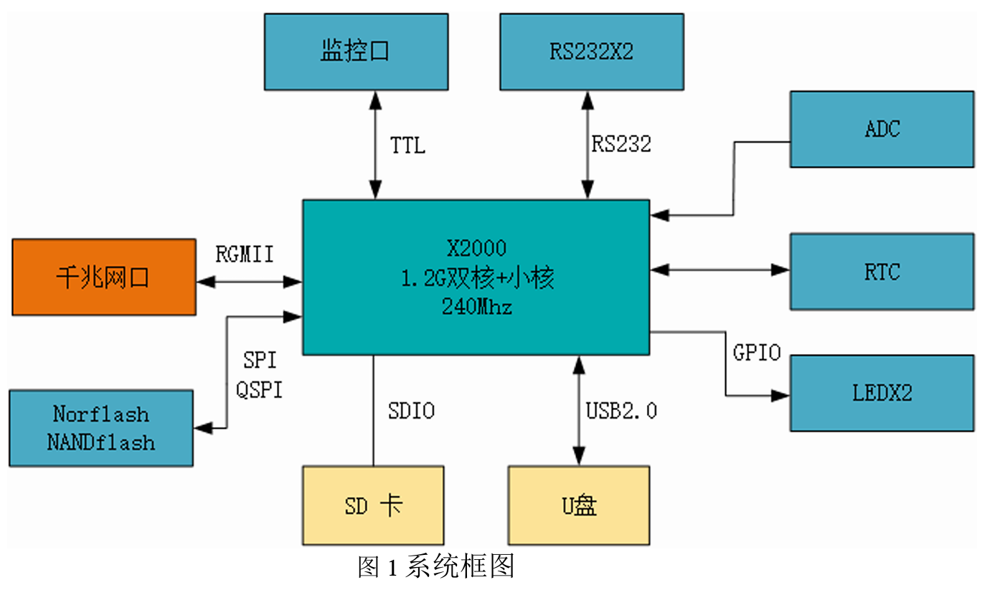

**CSCI 体系结构设计：**

​	数据记录器系统主体框架实现线程内、线程外处理。

​	主循环处理(SR_JLQ_FRANE_Main)： JLQ 采用嵌入式软件，包括：上电 初始化；版本显示；U 盘/TF 卡挂载；文件创建；监控发送数据处理；创建 ADC 数据采集线程、故障处理线程、RS232 数据采集线程、网口数据采集线程、 数据存储线程。  

​	SADC数据采集(CSC_JLQ_SAM)：主要完成对 6路 AD数据的采集功能， 利用软件定时器每1秒采集一次，将数据按照一定格式存储到循环队列。  

​	故障检测与状态(CSC_JLQ_FAULT)：对故障数据进行赋值，当出现故障时， 可以通过调试串口打印提示信息，同时状态灯 1停止闪烁。状态灯 2作为系统 级故障显示。

​	口令认证（CSC_JLQ_COM5）：系统具 RS232 通信接口监听功能，用以 密码登录。 

​	路 RS232 监听（CSC_JLQ_COM6）：系统具 RS232 通信接口监听功能， 可将通信接口数据，存储到循环队列。串口数据包大小不得大于1024。 

​	千兆网数据（CSC_JLQ_NET）：系统具网口通信接口监听功能，可将通 信接口数据，存储到循环队列。网口数据包大小不得大于1024。 

​	 数据记录（ CSC_JLQ_RECORD ）：可将 CSC_JLQ_SAM 、 CSC_JLQ_COM5、CSC_JLQ_COM6、CSC_JLQ_NET 组件中的数据存储到 TF 或U盘中。  数据记录器系统软件的顶层结构图如图2所示。

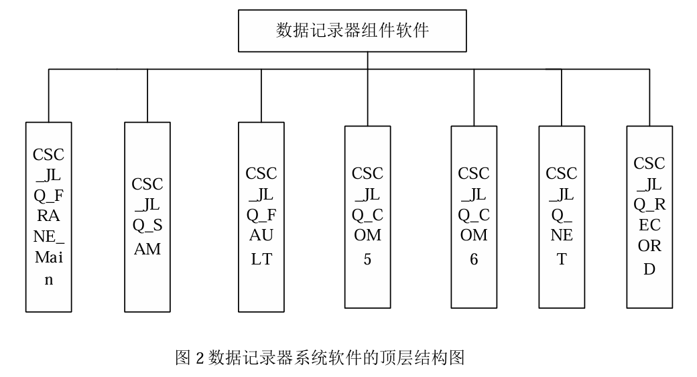

**执行方案：**

​	系统软件主要由主函数和任务线程组成。同时又根据不同的需求设计了如 下所示的所有模块，以完成数据记录器技术记录、对外数据输入输出、等功能。 图 3所示：系统软件主要由主函数和5个线程函数组成。同时又根据不同的需 求设计了如下所示的所有模块，以完数据采集、对外数据输入输出、认证登录 等功能。

​	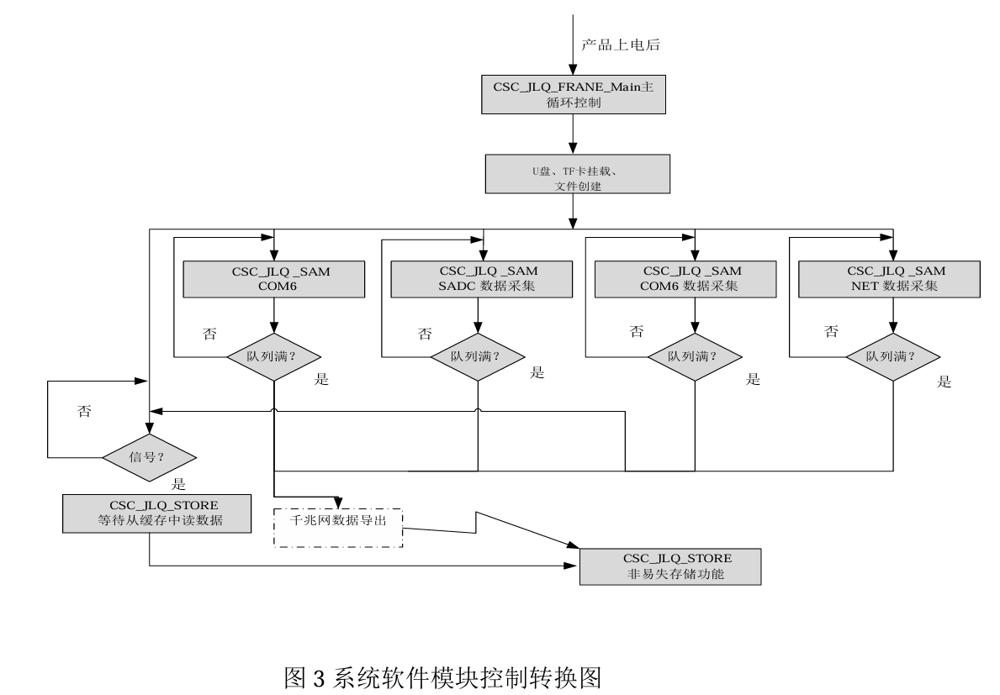

**主循环控制单元：**

​	主循环控制单元：打开RTC设备、挂载U盘/TF 卡、版本显示、创建文件、 创建 SADC 数据记录线程、创建故障检测线程、创建串口数据采集线程、网 口线程、数据记录线程。  主循环控制单元部件包括如下11个软件单元，如表1所示：

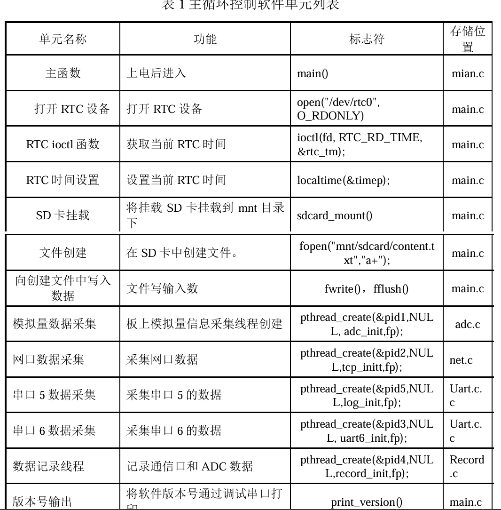

​	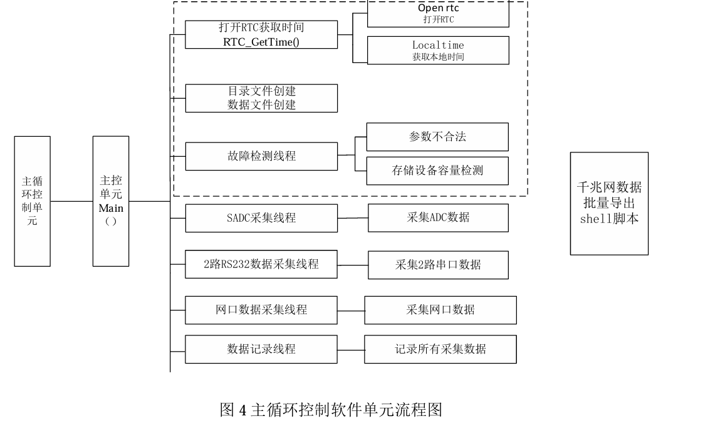

**“模拟量采集控制单元”软件部件（CSC_JLQ_SAM）**

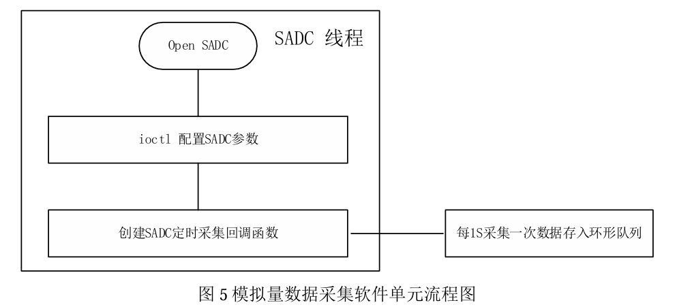

数据包内容结构：

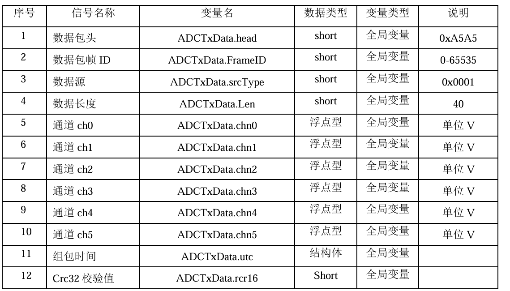

注意：SADC 接口对应 2 个乒乓数据缓冲区，一旦接收一包完整的数据，则存入队列，当该队列存满之后，将满队列的数据存入到TF卡、u盘，数据继续放空的队列。

**“故障检测控制单元”软件部件（CSC_JLQ_FAULT）**  程序加入打印，此处无需单独线程进行故障诊断。同时加入看门狗来喂狗， 防止程序跑死。

**“串口5数据采集控制单元”软件部件（CSC_JLQ_COM5）**

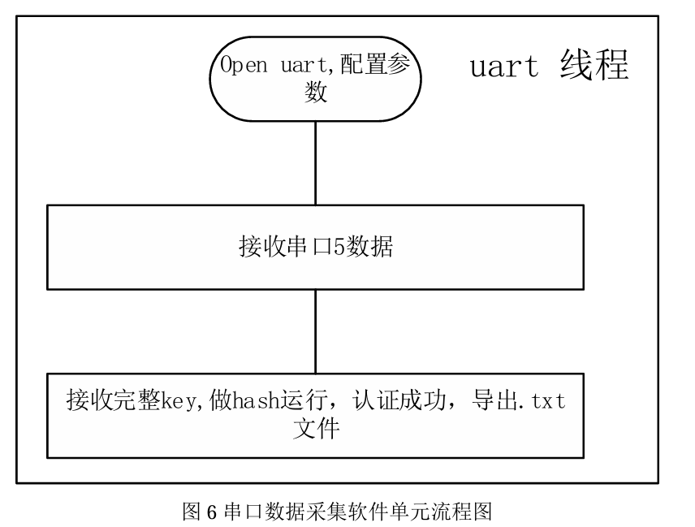

**“串口6数据采集控制单元”软件部件（CSC_JLQ_COM6）**

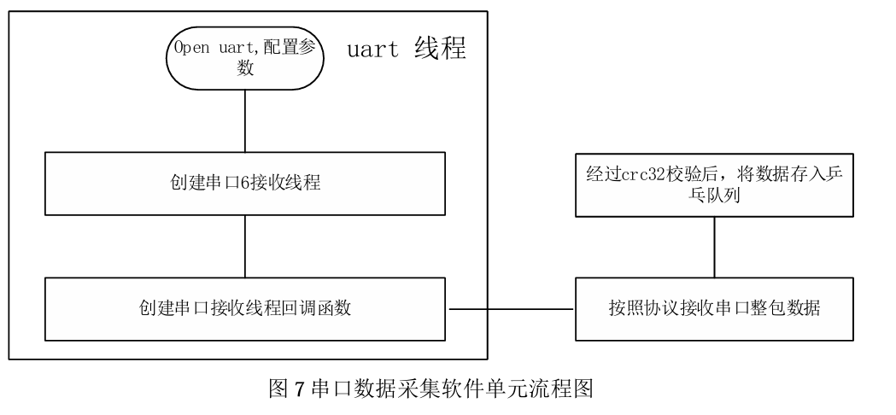

数据包结构：

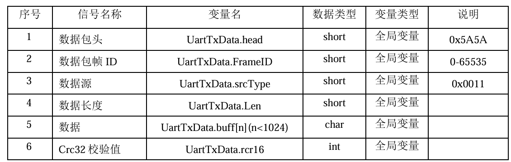

**“网络数据采集控制单元”软件部件（CSC_JLQ_NET）**

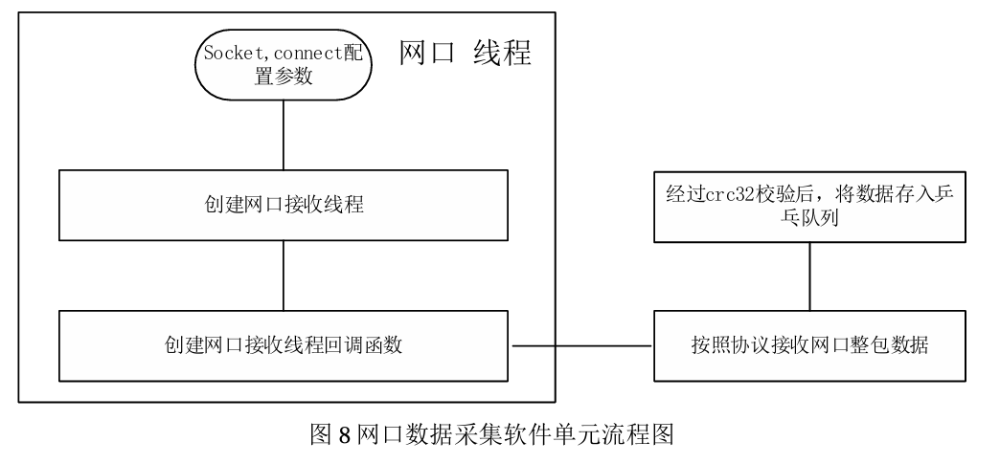

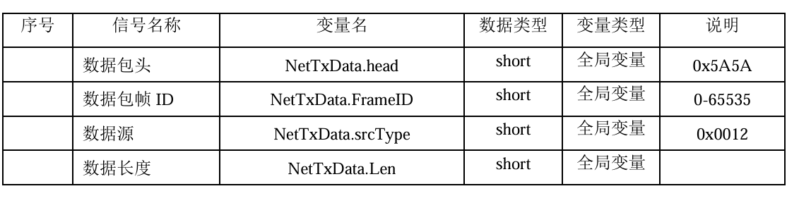

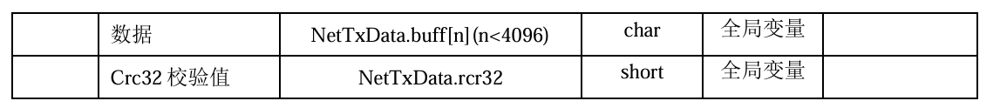

**“数据记录单元”软件部件（CSC_JLQ_JL）**

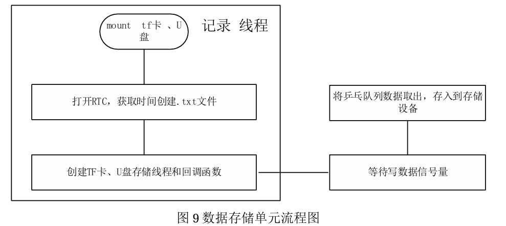

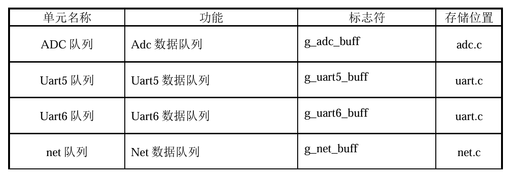

状态控制：

​	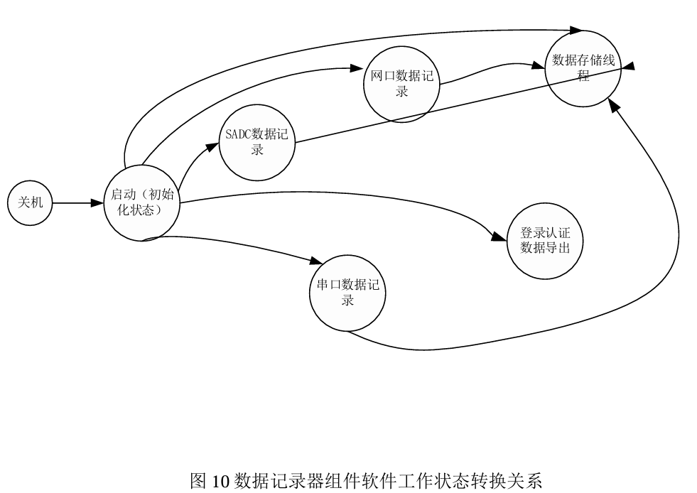

**接口设计：**

